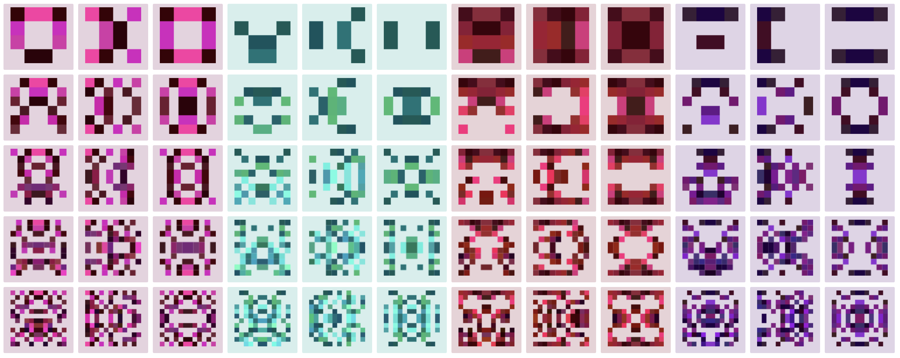

# @stevvvns/pixel-avatar



## What?

This is a fork of [randpix](https://github.com/LIMPIX31/randpix) with some added opinionated conventions you didn't ask for.

## Why?

I think randpix makes cool-looking avatars, but it doesn't build on modern version of node, and I wanted to emphasize distinguishability between avatars (and the string they represent), so by default I center the color palette around a color derived from a hash of the string, and similarly pick a consistent symmetry.

## How

`$ npm i --save @stevvns/pixel-avatar`

Check out [src/index.html](./src/index.html) for an example of how to generate avatars.

If you don't care for my conventions, the second parameter to `getAvatar` corresponds to the `RandpixOptions` from [randpix](https://github.com/LIMPIX31/randpix).

```typescript
interface RandpixOptions {
  size?: number;
  scale?: number;
  color?: Color; // [r: number, g: number, b: number, a?: number]
  colorScheme: ColorScheme; // see https://github.com/LIMPIX31/randpix/blob/master/themes.ts, array of 3-4 Colors
  fillFactor?: number;
  symmetry?: 'horizontal' | 'vertical' | 'quad';
  seed: string;
  colorBias?: number;
  grayscaleBias?: boolean;
};

```

This returns `{ iamgeUrl, color }` with the avatar data, and the base color derived from the supplied string as `[hue, saturation%, lightness%]`.
